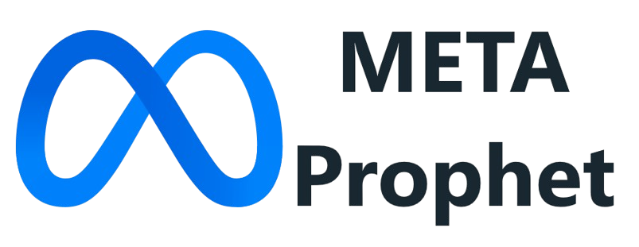
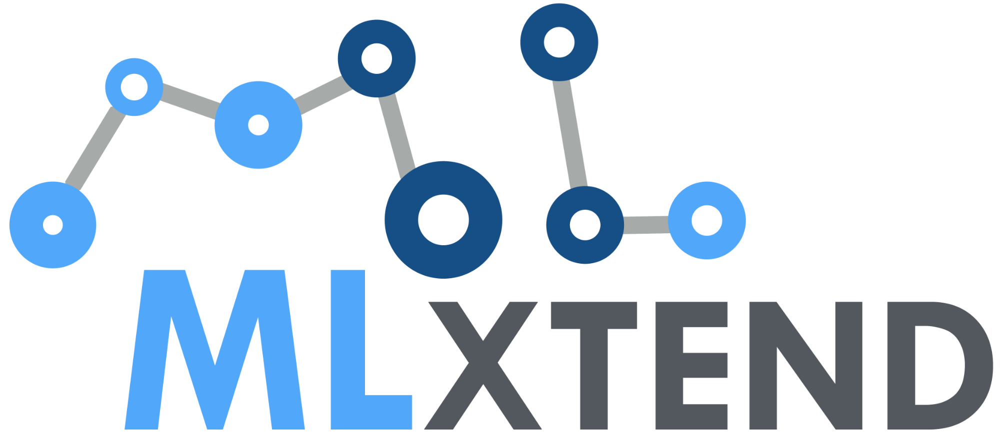
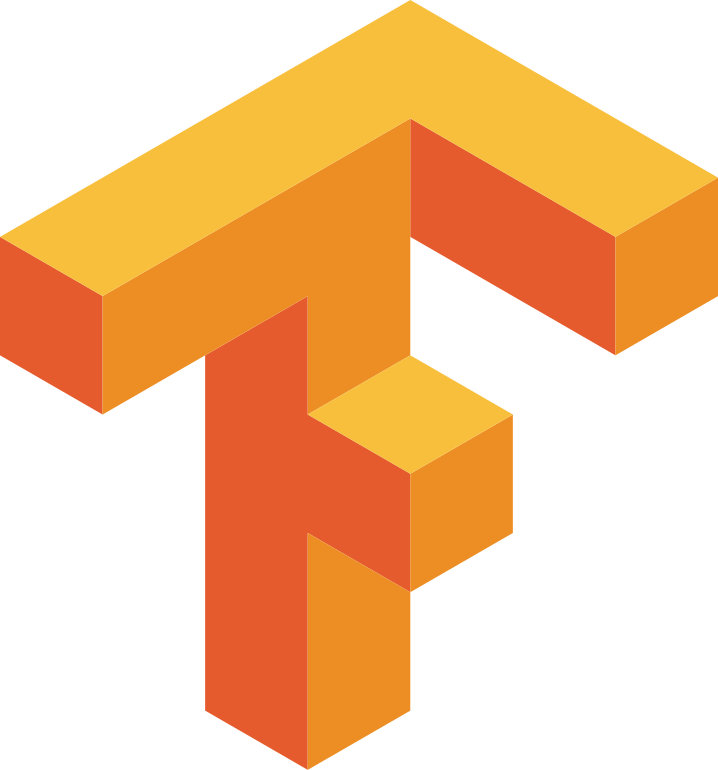
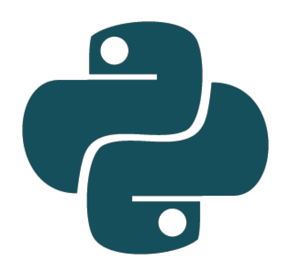
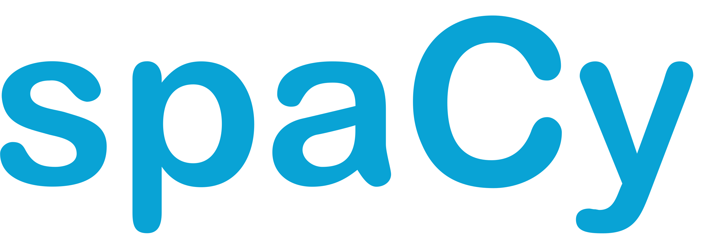
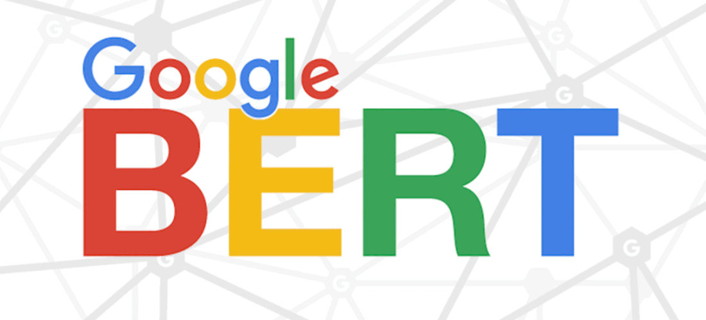
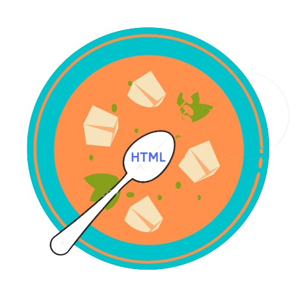

#  Welcome to my GitHub Page! 

  

### About Me
Hello and welcome! I'm a passionate data scientist with a knack for predictive analytics, specializing in Natural Language Processing (NLP) and time series analysis. Occasionally, I trade as a hobby, applying machine learning predictive modeling and technical on-chain analysis. Additionally, I have a strong foundation in classical machine learning and possess the requisite mathematical prowess.

Currently, I’m exploring computer vision with deep learning, specifically using Convolutional Neural Networks (CNNs), with the goal of developing software to detect human emotions. Another passion project involves creating a package for collecting cryptocurrency data via APIs and implementing advanced prediction algorithms to forecast trends.

Thank you for visiting, and I look forward to engaging with fellow enthusiasts and collaborators!

### Social Media

  

  

  

  

### Languages and Tools

#### Languages
<table>
  <tr>
    <th>Python3</th>
    <th>C</th>
    <th>HTML</th>
    <th>CSS</th>
    <th>JS</th>
  </tr>
  <tr>
    <td style="text-align: center;"></td>
    <td style="text-align: center;"></td>
    <td style="text-align: center;"></td>
    <td style="text-align: center;"></td>
    <td style="text-align: center;"></td>
  </tr>
</table>

#### Database
<table>
  <tr>
    <th>MS SQL Server</th>
    <th>MySQL</th>
    <th>PostgreSQL</th>
  </tr>
  <tr>
    <td style="text-align: center;"></td>
    <td style="text-align: center;"></td>
    <td style="text-align: center;"></td>
  </tr>
</table>

#### Frameworks and Libraries

##### My tools for Data Manipulation & Visualization
<table>
  <tr>
    <th>NumPy</th>
    <th>Pandas</th>
    <th>Matplotlib</th>
    <th>Seaborn</th>
    <th>Plotly</th>
  </tr>
  <tr>
    <td style="text-align: center;"></td>
    <td style="text-align: center;"></td>
    <td style="text-align: center;"></td>
    <td style="text-align: center;"></td>
    <td style="text-align: center;"></td>
  </tr>
</table>

##### My tools for Statistical Analysis, Time Series Analysis
<table>
  <tr>
    <th>SciPy</th>
    <th>Statsmodels</th>
    <th>Facebook Prophet</th>
  </tr>
  <tr>
    <td style="text-align: center;"></td>
    <td style="text-align: center;"></td>
    <td style="text-align: center;"></td>
  </tr>
</table>
  
##### My tools for Machine Learning
<table>
  <tr>
    <th>Scikit-Learn</th>
    <th>XGBoost</th>
    <th>MLxtend</th>
    <th>TensorFlow</th>
    <th>Keras</th>
  </tr>
  <tr>
    <td style="text-align: center;"></td>
    <td style="text-align: center;"></td>
    <td style="text-align: center;"></td>
    <td style="text-align: center;"></td>
    <td style="text-align: center;"></td>
  </tr>
</table>

##### My tools for Natural Language Processing
<table>
  <tr>
    <th>NLTK</th>
    <th>SpaCy</th>
    <th>Gensim</th>
    <th>BERT</th>
  </tr>
  <tr>
    <td style="text-align: center;"></td>
    <td style="text-align: center;"></td>
    <td style="text-align: center;"></td>
    <td style="text-align: center;"></td>
  </tr>
</table>

##### My tools for API, Web Scraping
<table>
  <tr>
    <th>Requests</th>
    <th>Beautiful Soup</th>
    <th>Selenium</th>
  </tr>
  <tr>
    <td style="text-align: center;"></td>
    <td style="text-align: center;"></td>
    <td style="text-align: center;"></td>
  </tr>
</table>

  
#### Environments, Testing, Other
<table>
  <tr>
    <th>Development Environments</th>
    <th>Testing Frameworks</th>
    <th>Version Control</th>
    <th>Business Intelligence</th>
  </tr>
  <tr>
    <td style="text-align: center;"></td>
    <td style="text-align: center;"></td>
    <td style="text-align: center;"></td>
    <td style="text-align: center;"></td>
  </tr>
  <tr>
    <td style="text-align: center;"></td>
    <td></td>
    <td></td>
    <td></td>
  </tr>
  <tr>
    <td style="text-align: center;"></td>
    <td></td>
    <td></td>
    <td></td>
  </tr>
</table>

Feel free to explore my projects and reach out if you have any questions or collaboration opportunities. I'm actively seeking job opportunities where I can apply my skills and contribute to innovative projects. Additionally, I'm enthusiastic about joining a team for Kaggle competitions to tackle exciting data challenges and further refine my skills. If you're interested in teaming up, don’t hesitate to contact me.

Your feedback and insights are always appreciated. Let’s connect and explore how we can work together to create impactful solutions and achieve great results!

 

